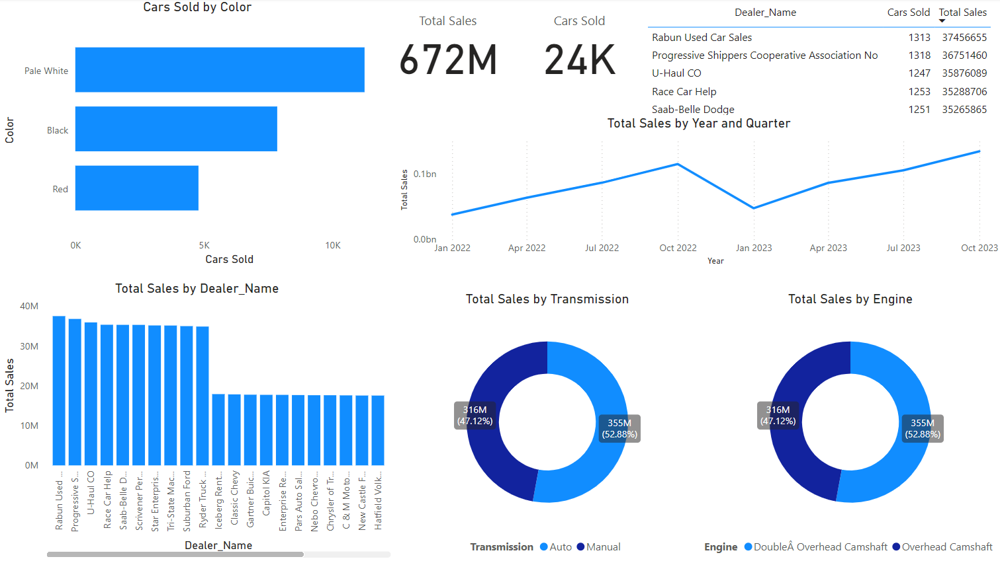

# 🚗 Power BI Car Sales Dashboard  

## Overview  
This Power BI dashboard provides key insights into car sales performance, dealer success, and customer preferences.  

## Visuals Included  
- **Total Sales & Cars Sold (Cards)** – Displays total revenue and units sold.  
- **Sales by Dealer (Column Chart)** – Highlights sales performance across dealers.  
- **Top 5 Dealers (Table)** – Shows top dealers by sales and cars sold.  
- **Sales by Transmission & Engine Type (Dhonut Charts)** – Compares sales based on transmission and engine type.  
- **Car Color Preferences (Bar Chart)** – Displays most popular car colors.  
- **Sales Trend Over Time (Line Chart)** – Tracks sales changes over time.  

## Dataset  
- **File:** `Car Sales.xlsx`  
- **Key Columns:** Dealer Name, Price, Transmission, Engine, Color, Date.  

    

## Connect with Me

  
